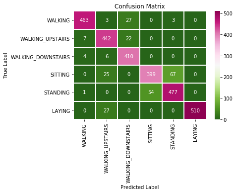
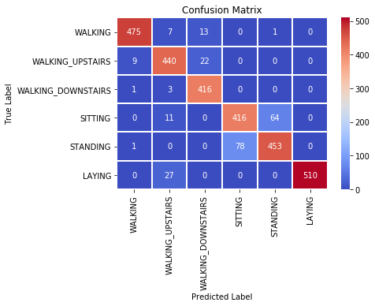

# CNN and LSTM for Human Activity Recognition

Human Activity recognition using 1D Convolutional Neural Network and LSTM (RNN)

# Dataset

  - **[UCI HAR](https://archive.ics.uci.edu/ml/datasets/Human+Activity+Recognition+Using+Smartphones)**

# Tools

- **Jupyter Notebook**

# CNN Model
```sh
model = Sequential()
model.add(Conv1D(filters=64, kernel_size=3, activation='relu', input_shape=(n_timesteps,n_features)))
model.add(Conv1D(filters=64, kernel_size=3, activation='relu', padding = 'same'))
model.add(Dropout(0.3))
model.add(MaxPooling1D(pool_size=2))
model.add(Flatten())
model.add(Dense(100, activation='relu'))
model.add(Dense(n_outputs, activation='softmax'))
model.compile(loss='categorical_crossentropy', optimizer='adam', metrics=['accuracy'])
```

# Description
- **Confusion Matrix** using **LSTM** for human activity recognition


- **Confusion Matrix** using **CNN** for human activity recognition

